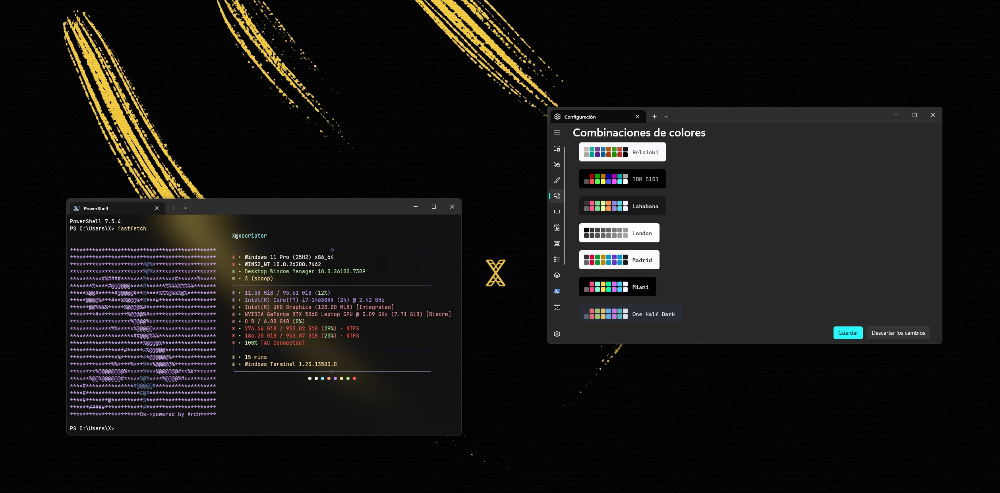
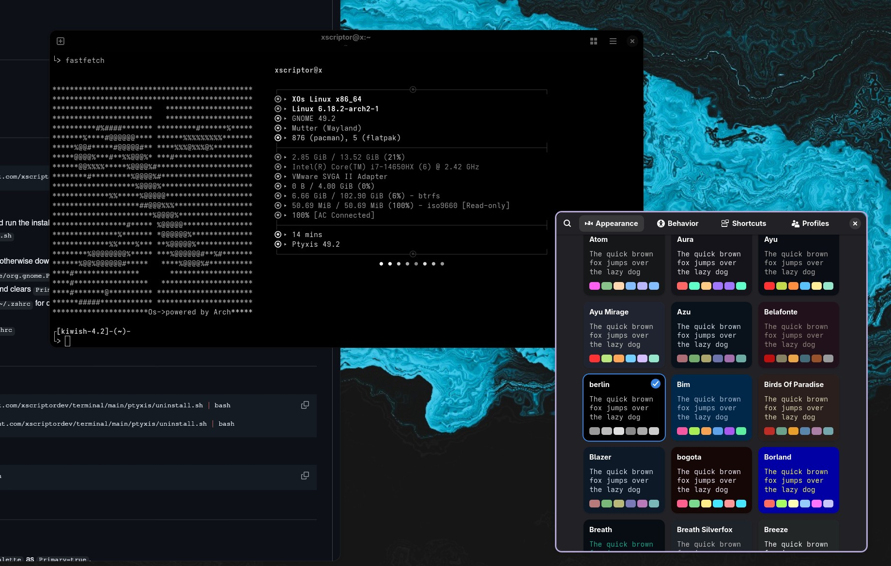

<h1 align="center">Terminal Xscriptor</h1>

My own collection of terminal themes and color schemes designed for a consistent look and feel across Windows, macOS, and Linux.

<h2 align="center">Table of Contents</h2>

<ul>
  <li><a href="#previews">Previews</a> </li>
  <li><a href="#supported-terminals">Supported Terminals</a> </li>
  <li><a href="#prompts">Prompts</a> </li>
  <li><a href="#related-files">Related Files</a> </li>
  <li><a href="#x">X</a> </li>
</ul>

<h2 align="center" id="previews">Previews</h2>

  

  
Click here to see more previews

  <table>
    <tr>
      <td align="center">
        
      </td>
      <td align="center">
        
      </td>
      <td align="center">
        
      </td>
      <td align="center">
        
      </td>
    </tr>
  </table>

<h2 align="center" id="supported-terminals">Supported Terminals</h2>

<h3>Universal Installer</h3>

You can use the universal installer to automatically configure the theme for your preferred terminal emulator. Just run the following command and select your terminal from the menu:

<pre><code>wget -qO- https://raw.githubusercontent.com/xscriptor/terminal/main/emulators/install.sh | bash</code></pre>

Supported terminals include Alacritty, Black Box, Contour, Foot, Ghostty, GNOME Terminal, Guake, Hyper, iTerm2, Kitty, Konsole, Mintty, MobaXterm, PowerShell, Ptyxis, PuTTY, Rio, Tabby, Terminal.app, Terminator, Termux, Tilix, Warp, Wave, WezTerm, and XFCE Terminal.

For quick install commands and per-terminal setup details, see the <a href="./emulators/README.md">Emulators README</a>.

<h2 align="center" id="prompts">Prompts</h2>

Under active development. Currently supported: <a href="./prompts/starship/starship.toml">Starship</a>.

<h2 align="center" id="related-files">Related Files</h2>

<ul>
  <li><a href="./CONTRIBUTING.md">CONTRIBUTING.md</a></li>
  <li><a href="./CODE_OF_CONDUCT.md">CODE_OF_CONDUCT.md</a></li>
  <li><a href="./SECURITY.md">SECURITY.md</a></li>
  <li><a href="./SUPPORT.md">SUPPORT.md</a></li>
  <li><a href="./LICENSE">LICENSE</a></li>
</ul>

 

<h2>X</h2>

 & 

 & 

